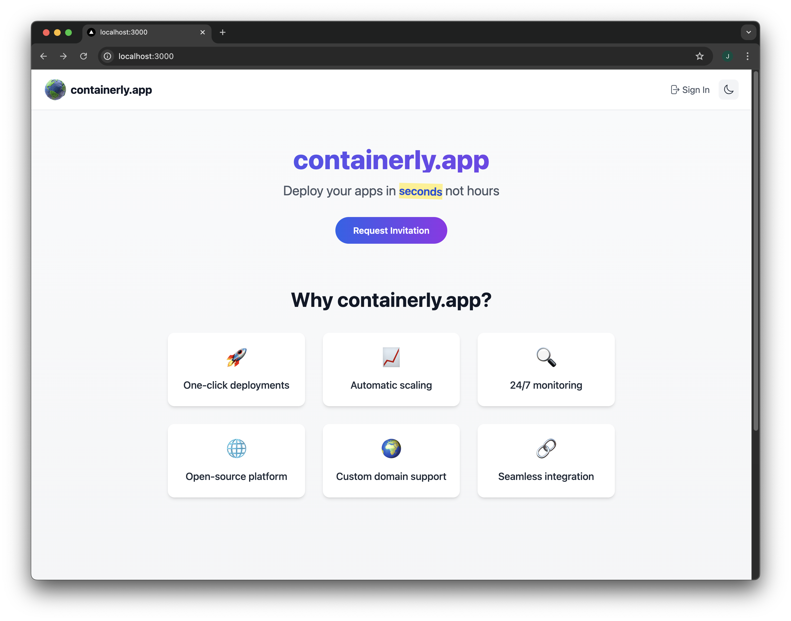

# Containerly

Containerly is a modern container deployment platform that makes it easy to deploy and manage containerized applications. Built with Next.js and Docker, it offers a seamless experience for developers to deploy their applications with just a few clicks.

## Features

- 🚀 One-click deployments
- 🔒 Secure container isolation
- 📊 Resource monitoring and management
- 👥 User authentication with Google
- 💳 Premium tier with expanded capabilities
- 🎯 Resource limits and quotas
- 🔄 Container lifecycle management

## Architecture

The application is built using:

- **Frontend**: Next.js 14 with React
- **Backend**: Node.js with Docker API integration
- **Authentication**: NextAuth.js with Google provider
- **Styling**: Tailwind CSS
- **State Management**: React Hooks
- **Monitoring**: Real-time Docker stats

## Resource Limits

Free and Premium tiers have different container limits:
